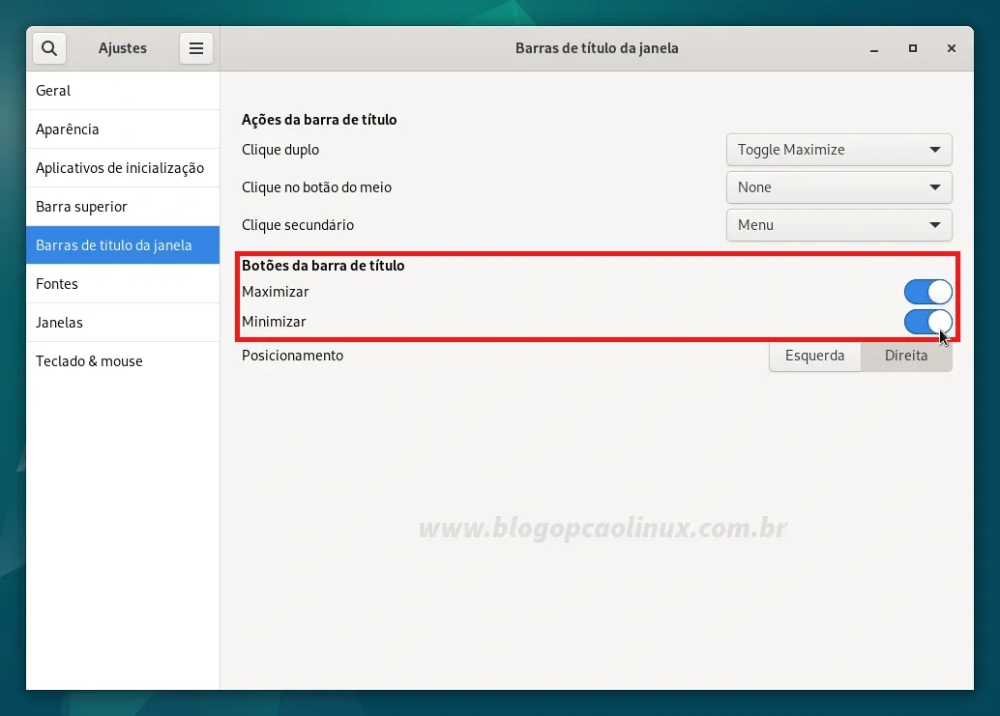

# Configurando a sources.list do Debian 12 Bookworm

Configurando o arquivo sources.list para buscar atualizações dos repositórios non-free do Debian.

Por padrão, somente os repositórios main e o non-free-firmware vem habilitados no sistema, nos limitando a instalar apenas softwares livres e de códido aberto que estão em conformidade com à DFSG (Debian Free Software Guidelines) e os firmwares não-livres para os dispositivos. Além disso, a mídia que utilizamos para instalar o Debian também fica "habilitada" no sources.list (sendo necessário que insira a mesma toda vez que precisar instalar algum pacote, como se fosse um repositório local).

## Configuração da sources.list pelo terminal

``` bash
su -
mv /etc/apt/sources.list /etc/apt/sources.list.bkp
nano /etc/apt/sources.list
```

E copie e cole todo o conteúdo abaixo no seu editor de texto:

```
#############################################################################################################
#                                Repositórios Oficiais - Debian 12 "Bookworm"                               #
#############################################################################################################
## Para habilitar os repos de código fonte (deb-src) e Backports basta retirar a # da linha correspondente ##
#############################################################################################################

deb http://deb.debian.org/debian/ bookworm main contrib non-free non-free-firmware
# deb-src http://deb.debian.org/debian/ bookworm main contrib non-free non-free-firmware

deb http://security.debian.org/debian-security bookworm-security main contrib non-free non-free-firmware
# deb-src http://security.debian.org/debian-security bookworm-security main contrib non-free non-free-firmware

deb http://deb.debian.org/debian bookworm-updates main contrib non-free non-free-firmware
# deb-src http://deb.debian.org/debian bookworm-updates main contrib non-free non-free-firmware

## Debian Bookworm Backports
# deb http://deb.debian.org/debian bookworm-backports main contrib non-free non-free-firmware
# deb-src http://deb.debian.org/debian bookworm-backports main contrib non-free non-free-firmware

##############################################################################################################
 ```

# Habilitando o sudo no Debian 12 "Bookworm"

Caso queira habilitar o sudo no Debian Bookworm, abra um terminal e instale o pacote sudo (caso não esteja instalado):

``` bash
apt install sudo
```

E em seguida, adicione o seu usuário ao grupo "sudo" com o comando:

``` bash
su -

## Substitua o USUARIO pelo nome do seu usuário:
adduser USUARIO sudo
```

Será necessário reiniciar o seu sistema para que esta alteração seja aplicada e, logo após, você poderá executar comandos normalmente com o sudo!

# Habilitando os botões de minimizar e maximizar do GNOME

Caso queira habilitar tais botões, você deve abrir o aplicativo "Ajustes" (na seção "Utilitários"), vá em "Barras de título da janela" e selecione as opções "Maximizar" e "Minimizar", como mostrado pela imagem abaixo:

