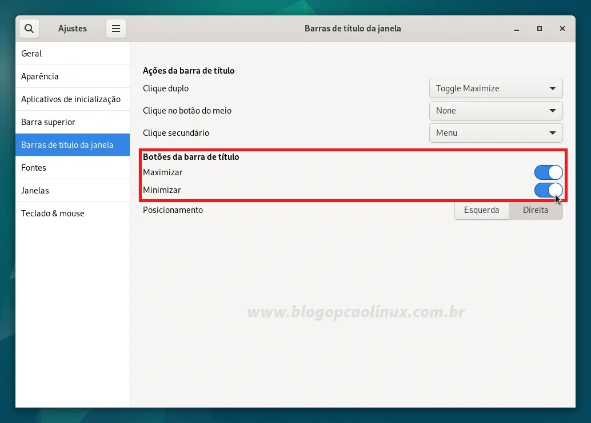

# Configurando a sources.list do Debian 12 Bookworm

Configurando o arquivo sources.list para buscar atualizações dos repositórios non-free do Debian.

Por padrão, somente os repositórios main e o non-free-firmware vem habilitados no sistema, nos limitando a instalar apenas softwares livres e de códido aberto que estão em conformidade com à DFSG (Debian Free Software Guidelines) e os firmwares não-livres para os dispositivos. Além disso, a mídia que utilizamos para instalar o Debian também fica "habilitada" no sources.list (sendo necessário que insira a mesma toda vez que precisar instalar algum pacote, como se fosse um repositório local).

## Configuração da sources.list pelo terminal

``` bash
su -
mv /etc/apt/sources.list /etc/apt/sources.list.bkp
nano /etc/apt/sources.list
```

E copie e cole todo o conteúdo abaixo no seu editor de texto:

```
#############################################################################################################
#                                Repositórios Oficiais - Debian 12 "Bookworm"                               #
#############################################################################################################
## Para habilitar os repos de código fonte (deb-src) e Backports basta retirar a # da linha correspondente ##
#############################################################################################################

deb http://deb.debian.org/debian/ bookworm main contrib non-free non-free-firmware
# deb-src http://deb.debian.org/debian/ bookworm main contrib non-free non-free-firmware

deb http://security.debian.org/debian-security bookworm-security main contrib non-free non-free-firmware
# deb-src http://security.debian.org/debian-security bookworm-security main contrib non-free non-free-firmware

deb http://deb.debian.org/debian bookworm-updates main contrib non-free non-free-firmware
# deb-src http://deb.debian.org/debian bookworm-updates main contrib non-free non-free-firmware

## Debian Bookworm Backports
# deb http://deb.debian.org/debian bookworm-backports main contrib non-free non-free-firmware
# deb-src http://deb.debian.org/debian bookworm-backports main contrib non-free non-free-firmware

##############################################################################################################
 ```

# Habilitando o sudo no Debian 12 "Bookworm"

Caso queira habilitar o sudo no Debian Bookworm, abra um terminal e instale o pacote sudo (caso não esteja instalado):

``` bash
apt install sudo
```

E em seguida, adicione o seu usuário ao grupo "sudo" com o comando:

``` bash
su -

## Substitua o USUARIO pelo nome do seu usuário:
adduser USUARIO sudo
```

Será necessário reiniciar o seu sistema para que esta alteração seja aplicada e, logo após, você poderá executar comandos normalmente com o sudo!

# Habilitando os botões de minimizar e maximizar do GNOME

Caso queira habilitar tais botões, você deve abrir o aplicativo "Ajustes" (na seção "Utilitários"), vá em "Barras de título da janela" e selecione as opções "Maximizar" e "Minimizar", como mostrado pela imagem abaixo:



Uma outra opção (mais prática) é utilizar o terminal para habilitar os botões de minimizar e maximizar do GNOME, basta apenas executar o comando abaixo:

``` bash
## Pressione Ctrl + D caso esteja logado como root antes de executar esse comando, ok?!
gsettings set org.gnome.desktop.wm.preferences button-layout ':minimize,maximize,close'
```

# Otimizando a vida útil da bateria de seu notebook com o TLP

Se você está utilizando um notebook/netbook e quer instalar o TLP no seu Debian Bookworm, basta executar o comando abaixo:

``` bash
apt install tlp tlp-rdw
```

O serviço será iniciado automaticamente após a primeira reinicialização do sistema, mas caso já queira ativá-lo basta executar o comando a seguir:

``` bash
systemctl enable tlp && tlp start
```

Mais detalhes sobre o uso do TLP estão disponíveis na documentação oficial, acesse:

[TLP - Optimize Linux Laptop Battery Life](https://linrunner.de/tlp/)

# Adicionando o repositório Flathub (Flatpak)

Caso queira habilitar o suporte a Flatpaks no seu Debian, primeiramente é necessário instalar o pacote flatpak com o comando abaixo num terminal:

``` bash
sudo apt install flatpak
```

Após, adicione o repositório do Flathub.

    flatpak remote-add --if-not-exists flathub https://flathub.org/repo/flathub.flatpakrepo

Concluído esse processo você deve reiniciar o seu computador para que as alterações sejam aplicadas, ok?!

# Instalando os codecs no Debian 12 "Bookworm"

O Debian já traz, por padrão, o suporte à codificação e decodificação dos principais formatos livres de royalties e de código aberto, como é o caso do FLAC, Ogg, Opus, Theora e outros, bem como aos formatos AAC, H264 e MP3 graças às bibliotecas libav e ffmpeg disponíveis nos repositórios oficiais. Apesar disso, devido a questões legais, nem todos os codecs podem ser disponibilizados oficialmente na mídia de instalação, sendo necessário a instalação de pacotes adicionais.

Caso queira reproduzir (além dos formatos livres) a maioria dos formatos de áudio e vídeo no seu Debian Bookworm, basta executar o comando a seguir num terminal:

    sudo apt install faad ffmpeg gstreamer1.0-fdkaac gstreamer1.0-libav gstreamer1.0-vaapi gstreamer1.0-plugins-bad gstreamer1.0-plugins-base gstreamer1.0-plugins-good gstreamer1.0-plugins-ugly lame libavcodec-extra libavcodec-extra59 libavdevice59 libgstreamer1.0-0 sox twolame vorbis-tools

## Codecs extras para MPlayer e xine (DIVX, Windows Media, etc.)

Há também um conjunto de codecs extras (disponibilizado pelo site deb-multimedia.org) exclusivamente para os players MPlayer e xine que fornecem o suporte aos formatos DIVX, Quick Time, Real Video e Windows Media.

Caso utilize o Mplayer ou o xine e queira instalar os codecs extras para os mesmos, basta executar (como root) um dos comandos abaixo:

Se o seu Debian for de 64 bits:

    cd /tmp && wget http://www.deb-multimedia.org/pool/non-free/w/w64codecs/w64codecs_20071007-dmo2_amd64.deb && dpkg -i w64codecs_20071007-dmo2_amd64.deb && cd $HOME

# Ferramentas e Utilitários

## Suporte para extração e compactação de arquivos

Para poder compactar e extrair arquivos dos mais variados formatos no seu Debian 12 Bookworm será necessário instalar os pacotes e ferramentas necessárias. Abra um terminal e execute o comando abaixo:

    sudo apt install arc arj cabextract lhasa p7zip p7zip-full p7zip-rar rar unrar unace unzip xz-utils zip

## Instalando as fontes da Microsoft no Debian 12 "Bookworm"

Ao trabalhar com documentos criados no Windows, é normal que alguns deles fiquem com fontes ilegíveis e/ou não possam ser visualizados corretamente. Uma possível solução nestes casos é a instalação das Fontes da Microsoft (como Arial, Calibri, Times New Roman, Verdana e outras).

Para isso, certifique-se que tenha as dependências necessárias instaladas no seu sistema executando o comando abaixo:

    sudo apt install cabextract curl fontconfig xfonts-utils

E após, instale o pack de fontes da Microsoft no seu Debian Bookworm executando:

    sudo apt install ttf-mscorefonts-installer

## Instalando o GDebi

O GDebi é um pequeno utilitário que permite instalar pacotes .DEB facilmente no sistema, além de resolver automaticamente as dependências dos mesmos.

Para instalar o GDebi no Debian é simples, basta apenas executar o comando abaixo:

    sudo apt install gdebi

# Referêmcias

[Guia pos instalação Debian 12](https://www.blogopcaolinux.com.br/2023/06/Guia-pos-instalacao-Debian-12-Bookworm.html)